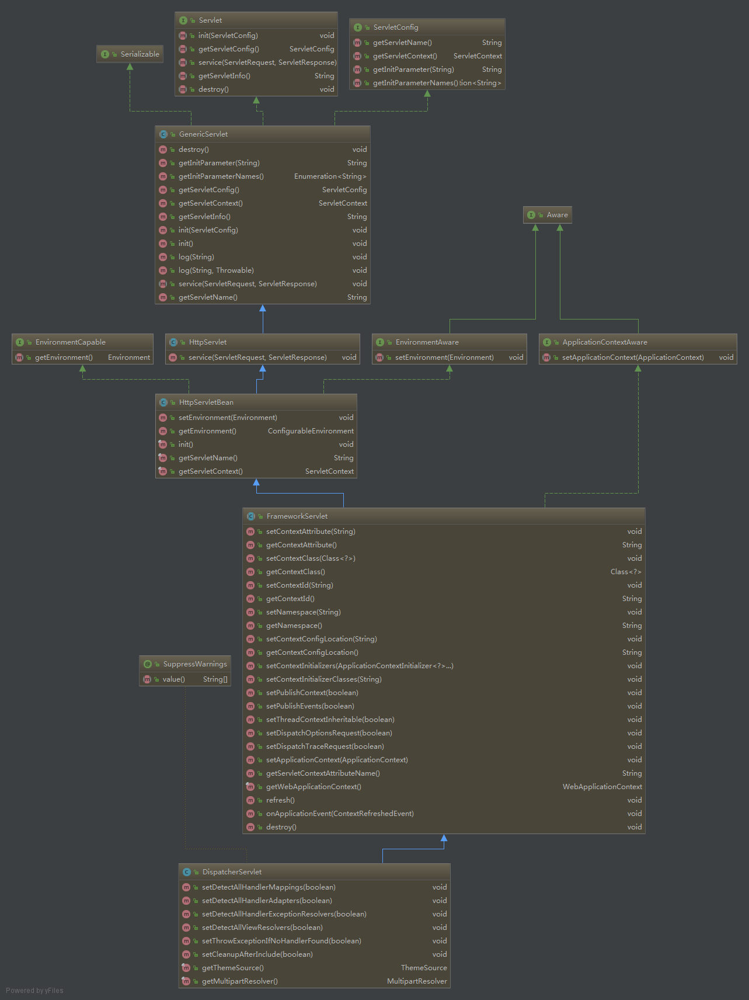

## SpringMVC初始化流程 ##
1. 先看一下SpringMVC类图结构

2. 我们知道Servlet在创建的过程中，会调用init()方法，执行一系列的初始化动作，而SpringMVC在初始化过程中，会将初始化的操作委托给子类（HttpServletBean）去执行,而HttpServletBean继承了HTTPServlet,所以它也是一个Servlet,同时它也是FrameworkServlet的父类，FrameworkServlet是DispatchServlet的父类，每一个类都会有自己的初始化动作。

### HttpServletBean的初始化 ###
```
public final void init() throws ServletException {
	if (logger.isDebugEnabled()) {
		logger.debug("Initializing servlet '" + getServletName() + "'");
	}

	// Set bean properties from init parameters.
	PropertyValues pvs = new ServletConfigPropertyValues(getServletConfig(), this.requiredProperties);
	if (!pvs.isEmpty()) {
		try {
			BeanWrapper bw = PropertyAccessorFactory.forBeanPropertyAccess(this);
			ResourceLoader resourceLoader = new ServletContextResourceLoader(getServletContext());
			bw.registerCustomEditor(Resource.class, new ResourceEditor(resourceLoader, getEnvironment()));
			initBeanWrapper(bw);
			bw.setPropertyValues(pvs, true);
		}
		catch (BeansException ex) {
			if (logger.isErrorEnabled()) {
				logger.error("Failed to set bean properties on servlet '" + getServletName() + "'", ex);
			}
			throw ex;
		}
	}

	// 让一些细节的操作留给子类去做它们喜欢的初始化.
	initServletBean();

	if (logger.isDebugEnabled()) {
		logger.debug("Servlet '" + getServletName() + "' configured successfully");
	}
}
```
HttpServletBean 初始化过程全在 init 方法中定义，它的核心就是创建 **BeanWrapper**。

通过 BeanWrapper 可以访问到 Servlet 的所有参数、资源加载器加载的资源以及 DispatcherServlet中的所有属性，并且可以像访问 Javabean 一样简单。

### FrameworkServlet初始化 ###
```
protected final void initServletBean() throws ServletException {
	// 此处代码省略
	try {
		this.webApplicationContext = initWebApplicationContext();
		initFrameworkServlet();
	}
	// 此处代码省略
}
```
```
protected WebApplicationContext initWebApplicationContext() {
	// 获取rootContext容器
	WebApplicationContext rootContext =
			WebApplicationContextUtils.getWebApplicationContext(getServletContext());
	WebApplicationContext wac = null;
	// 获取SpringMVC容器
	if (this.webApplicationContext != null) {
		wac = this.webApplicationContext;
		if (wac instanceof ConfigurableWebApplicationContext) {
			ConfigurableWebApplicationContext cwac = (ConfigurableWebApplicationContext) wac;
			if (!cwac.isActive()) {
				if (cwac.getParent() == null) {
					cwac.setParent(rootContext);
				}
				configureAndRefreshWebApplicationContext(cwac);
			}
		}
	}
	if (wac == null) {
		wac = findWebApplicationContext();
	}
	if (wac == null) {
		wac = createWebApplicationContext(rootContext);
	}
	// 刷新SpringMVC容器
	if (!this.refreshEventReceived) {
		// 将具体的刷新操作交给子类实现
		onRefresh(wac);
	}
	// 此处代码省略
	return wac;
}
```
FrameworkServlet在初始化的过程中主要负责其SpringMVC容器的初始化。它取得 Spring根容器的目的是将其设为 SpringMVC 的父容器。

### DispatchServlet的初始化 ###
```
protected void onRefresh(ApplicationContext context) {
	initStrategies(context);
}
```
```
protected void initStrategies(ApplicationContext context) {
	// 初始化多文件上传解析器
	initMultipartResolver(context);
	// 初始化区域解析器
	initLocaleResolver(context);
	// 初始化主题解析器
	initThemeResolver(context);
	// 初始化HandlerMapping
	initHandlerMappings(context);
	// 初始化HandlerAdapter
	initHandlerAdapters(context);
	// 初始化处理器异常解析器
	initHandlerExceptionResolvers(context);
	// 初始化请求到视图的转换器
	initRequestToViewNameTranslator(context);
	// 初始化视图解析器
	initViewResolvers(context);
	// 初始化Flash映射管理器
	initFlashMapManager(context);
}
```
DispatchServlet在初始化过程中，主要负责初始化各种不同的组件。它好比给 SpringMVC 添加功能模块，一旦功能模块添加完毕，SpringMVC 就可以正常工作。因此 SpringMVC 的初始化工作也到此结束。

#### 参考 ####
[SpringMVC初始化过程](http://objcoding.com/2017/06/14/SpringMVC-initialization-process/)